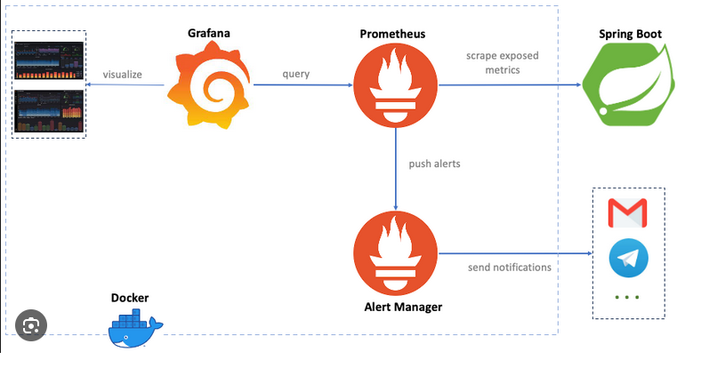

# Proyecto Spring Boot con Prometheus y Grafana
# incluyendo monitoreo de logs


## **Requisitos**

- Java 17
- Maven 3.x
- Docker y Docker Compose (opcional, para ejecutar Prometheus y Grafana)

## **Ejecución del Proyecto**

### **1. Ejecutar la Aplicación Spring Boot**

Para ejecutar la aplicación, usa el siguiente comando:

```bash
./mvnw spring-boot:run
```

La aplicación estará disponible en:

```
http://localhost:8081
```

### **2. Endpoints Disponibles**

#### **Hello World:**
- **GET /hello**
- Devuelve un mensaje de "Hello, World!".
- Ejemplo: [http://localhost:8081/hello](http://localhost:8081/hello)

#### **Métricas de Prometheus:**
- **GET /actuator/prometheus**
- Expone métricas en formato Prometheus.
- Ejemplo: [http://localhost:8081/actuator/prometheus](http://localhost:8081/actuator/prometheus)

---

## **Métricas Personalizadas**

El proyecto incluye las siguientes métricas personalizadas:

- **Contador de Líneas de Log:**
  - Nombre: `log_lines_emitted`
  - Descripción: Número de líneas de log emitidas por la aplicación.

- **Contador de Peticiones:**
  - Nombre: `http_requests_total`
  - Descripción: Número total de peticiones procesadas.

- **Histograma de Latencia:**
  - Nombre: `http_request_duration_seconds`
  - Descripción: Latencia de las peticiones HTTP.

---

## **Despliegue con Docker Compose**

El proyecto incluye un archivo `docker-compose.yml` para desplegar la aplicación junto con Prometheus y Grafana.

### **1. Construir la Imagen de la Aplicación**

Primero, construye la imagen Docker de la aplicación:

```bash
docker build -t my-spring-boot-app .
```

### **2. Ejecutar los Servicios**

Ejecuta los servicios con Docker Compose:

```bash
docker-compose up
```

Los servicios estarán disponibles en:

- **Spring Boot:** [http://localhost:8081](http://localhost:8081)
- **Prometheus:** [http://localhost:9090](http://localhost:9090)
- **Grafana:** [http://localhost:3000](http://localhost:3000)

### **3. Configurar Grafana**

Accede a Grafana en [http://localhost:3000](http://localhost:3000).

Inicia sesión con las credenciales predeterminadas:

- **Usuario:** `admin`
- **Contraseña:** `admin`

Importa el dashboard de Grafana proporcionado en el proyecto para visualizar las métricas.

---
### **4. Arquitectura **


## **Estructura del Proyecto Spring boot**


```
src/
└── main/
    ├── java/
    │   └── com/
    │       └── example/
    │           └── demo/
    │               ├── DemoApplication.java       (Clase principal)
    │               └── controller/
    │                   └── HelloController.java  (Controlador)
    └── resources/
        ├── application.properties                (Configuración de la aplicación)
        └── static/                               (Archivos estáticos)
```

---

## **Evidencia**
  Archivo PDF [Ver el PDF](./Evidencia.pdf)